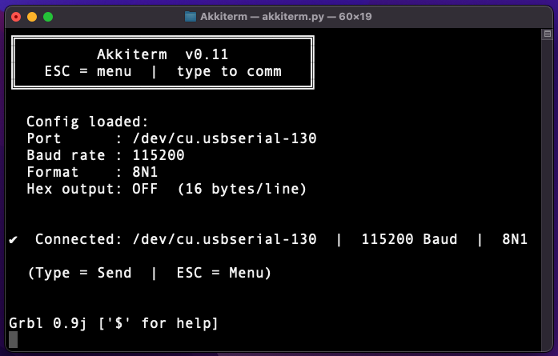
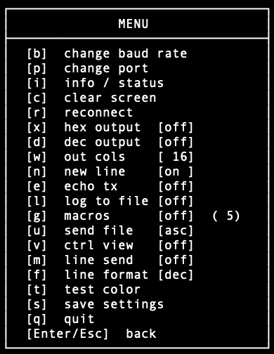
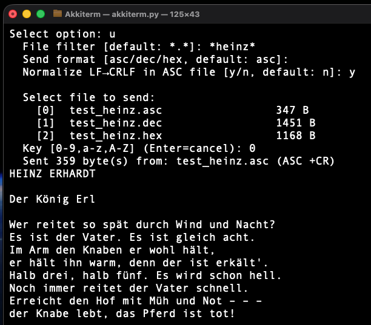
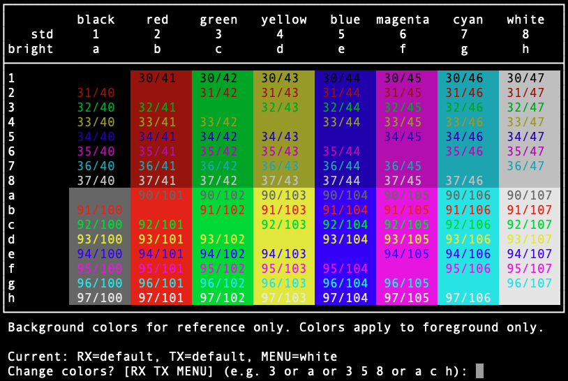
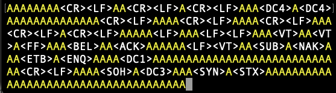

Akkiterm
========

A quick and dirty serial terminal application for the console, for now.  
Useful for communication with MCUs, debugging, etc.  

Works on all platforms that support Python and PySerial:

  - macOS
  - Linux
  - Windoze
  - ...

---------------------------------------------------------------------------------------------

---
## FEATURES (yet)

  - ASCII
  - HEX/DEC with optional formatting
  - log received output to local file
  - macros: configurable key bindings (ASCII/DEC/HEX)
  - send file (ASCII/DEC/HEX) with wildcard filter + one-key selection
  - local folder config save & autoload
  - local TX echo
  - newline mode (LF->CRLF)
  - now in color
  - now with optional visualization of control characters for RX and TX
  - console
  - enterless menu (yeah \o/)
  - ...


### SOME SCREENSHOTS

Startup with ```akkiterm.cfg``` in the local directory:  

  

The menu:  

  

Send file options:

  

Now in color:

  

And with control characters:

  

[...]


---
## INSTALLATION

Requirements:

 - Python 3
 - PySerial

In case you don't have PySerial installed or are not sure, get it with:

    pip install pyserial

or

    pip3 install pyserial

depending on your Python installation.


### Linux, macOS

Just copy ```akkiterm.py``` to a directory in your path and make it executable:

    chmod +x ./akkiterm.py

If ```python3``` does not invoke your Python interpreter, you need to change
the first line in ```akkiterm.py``` to

    #!/usr/bin/env python

although I would not recommend this. Go fix your installation and symlinks instead.


### Windows

I recommend [RealTerm][2]. Yo, rly :)

Otherwise, in case you dislike typing

    python3 d:\pathtowherever\longwindozepath\akkiterm.py

consider creating a batch file

    @echo off
    where py >nul 2>nul && py "%~dp0akkiterm.py" %* && goto :eof
    python "%~dp0akkiterm.py" %*

and store it, together with akkiterm.py, in a directory within your PATH variable.


---
## USAGE

Most should be self-explanatory (for now). Press ESC for the menu.  

In case a file ```akkiterm.cfg``` exists in the local directory, the configuration is loaded automatically.

[...]

### MACROS

Akkiterm supports sending messages/data with hotkeys if defined.  
So far, macros can be defined in the config file:

    MACRO_<key>_<TYPE>=<macro/data to be sent>

Type can be one of:

    ASC -> ASCII text
    DEC -> decimal numbers, to be sent as (character) codes
    HEX -> hexadecimal numbers, to be sent as (character) codes

Example:

    MACRO_1_ASC=Henlo, i bims die 1
    MACRO_2_ASC=Und i di 2
    MACRO_3_ASC=Drei, angenehm.
    MACRO_d_DEC=97 98 99 100 101
    MACRO_h_HEX=33 34 35 3a

With this, pressing
  - "1", "2" or "3" (```ASC```) will send the corresponding strings defined.  
  - "d" will send the character codes 97..101, resulting in '```abcde```'.  
  - "h" will send the character codes 0x33, 0x34, 0x35, 0x3a, which should give '```123:```'.

The provided "examples" directory contains a sample configuration file with a couple of macros defined.

### SEND FILE

Akkiterm can send a file from the local directory via ESC → ```[u]```.

The dialog asks for:

1. **File filter** — wildcard pattern(s), semicolon-separated, matched against the local directory.  
    Examples: ```*.txt```, ```*data*```, ```*.hex; *.dec```, ```*.*``` (default, matches everything)

2. **Send format**:

         asc  -> file is sent as raw bytes (binary/text), unchanged
         dec  -> file is parsed as whitespace-separated decimal values (0..255)
         hex  -> file is parsed as whitespace-separated hexadecimal values (00..FF)

3. **Normalize LF→CRLF** (ASC only) — replaces every bare ```\n``` with ```\r\n``` before sending.  
    Useful when the target expects CR+LF line endings.  
    For DEC and HEX files, simply include ```13 10``` (DEC) or ```0d 0a``` (HEX) tokens where needed.

4. **File selection** — matching files are listed and assigned a key (```0-9```, ```a-z```, ```A-Z```).  
    Press the corresponding key to send, or Enter to cancel.

Filter and format are remembered across sessions (```FILE_SEND_FILTER```, ```FILE_SEND_FORMAT```,
```FILE_SEND_ASC_CR``` in ```akkiterm.cfg```).

Three example files are provided in the "examples" directory.

---
## TODO
    - maybe add some up-to-date screenshots
    - trigger, send macro when sequence is received
    - optional delimiter for formatted output (e.g. CSV)
    - much more


---
## NEWS

### CHANGES 2026/04/10:
    - added updated screenshots

### CHANGES 2026/04/08:
    - added optional visualization of ASCII control characters also for TX echo

### CHANGES 2026/04/06:
    - added optional visualization of ASCII control characters

### CHANGES 2026/04/03:
    - changed menu selection to work without pressing Enter

### CHANGES 2026/04/02:
    - added color selection for RX and TX echo

### CHANGES 2026/04/01:
    - added a color test function

### CHANGES 2026/03/31:
    - added newline mode (LF->CRLF)

### CHANGES 2026/03/30:
    - added sample config file with macros
    - added three samples for sending ASC, DEC or HEX data files.

### CHANGES 2026/03/29:
    - added send file dialog with wildcard filter (*.txt; *data*; *.*)
    - added one-key file selection (0-9, a-z, A-Z)
    - added file send formats ASC/DEC/HEX
    - added optional ASC append CR for file send

### CHANGES 2026/03/28:
    - added local TX echo

### CHANGES 2026/03/27:
    - added macro system (configurable key bindings with ASC/DEC/HEX data)
    - config format: MACRO_<key>_<format>=<value> (e.g., MACRO_2_ASC=Hello, MACRO_L_HEX=aa bb e4)
    - added logging of received output to local file

### CHANGES 2026/03/25:
    - added DEC output mode (formatted, 3 digits with leading zeros)

### CHANGES 2026/03/24:
    - added HEX and DEC input (line-wise)

### CHANGES 2026/03/22:
    - added config file with automatic loading function on startup

### CHANGES 2026/03/21:
    - added HEX output
    - added HEX output formatting; newline after n bytes

### CHANGES 2026/03/18:
    - initial version


---
Have fun  
FMMT666(ASkr)  


[1]: https://pyserial.readthedocs.io
[2]: https://sourceforge.net/projects/realterm/
